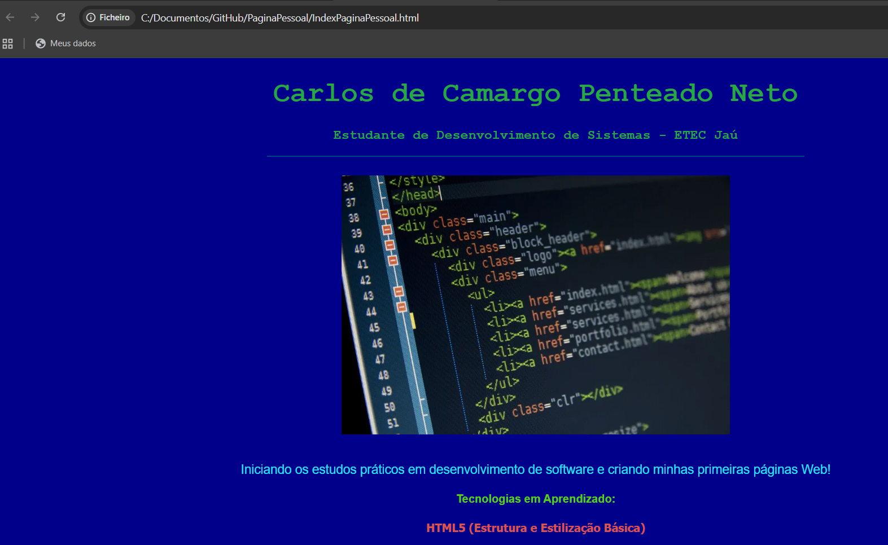

# Perfil do Estudante - ETEC Jaú

# 🚀 Primeiros Passos em Desenvolvimento de Sistemas - ETEC Jaú

Este repositório contém meus primeiros exercícios práticos desenvolvidos durante as 3 primeiras semanas do 
curso de **Técnico em Desenvolvimento de Sistemas/2026** na ETEC Jaú.

# Sobre o projeto 
*`IndexPaginaPessoal/`**: Página Web inicial construída em HTML5 explorando estilos inline de fontes, cores e imagens.

## Layout da Pagina HTML5

# Tecnologias utilizadas

- HTML5
- Git & GitHub

# Autor

Carlos de Camargo Penteado Neto

[https://www.linkedin.com/in/carlos-de-camargo-penteado-neto-83974430]
